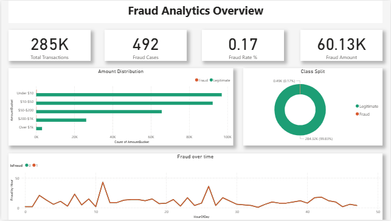
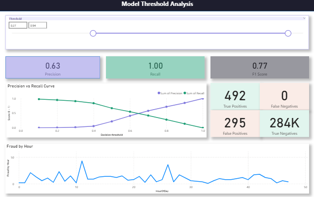
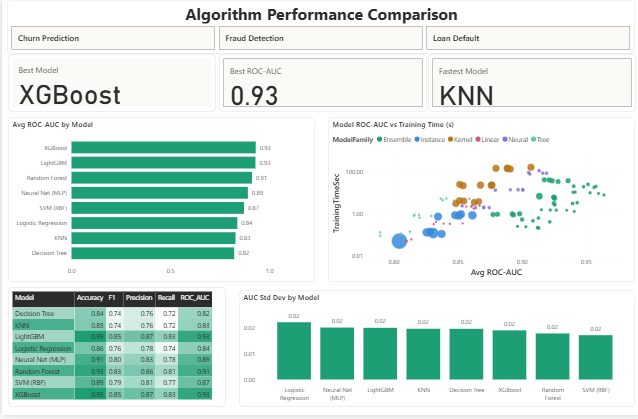

# Dashboard Fridays

A compilation of dashboards I build every friday of the week.

Each dashboard uses a different real-world dataset to build progressively advanced Power BI skills; from basic layout to DAX, multipage reports, drill through, bookmarks, and executive storytelling.

## Why
Power Bi is core skill for data roles. This repo demostrate my skill in real analysis with real datasets.

## Dashboards

### Week One - Fraud Analytics Overview

#### Dataset
**Name:** Credit Card Fraud Detection
**Source:** [Kaggle - Machine Learning Group - ULB](https://www.kaggle.com/datasets/mlg-ulb/creditcardfraud)

#### What I built
A single page fraud overview dashboard showing the scale, distribution, amd timing of fraudulent credit transactions.

### Week Two - Model Threshold Analysis

### Dataset
**Name:** Credit Card Fraud Detection
**Source:** [Kaggle - Machine Learning Group - ULB](https://www.kaggle.com/datasets/mlg-ulb/creditcardfraud)

#### What I built
An interactive threshold analysis dashboard that lets stakeholders drag a
slicer and instantly see how changing the model decision boundary affects
precision, recall, F1 score, and the full confusion matrix. Designed to
demonstrate why "accuracy" is meaningless for imbalanced datasets and how
the precision-recall trade-off drives real business decisions.

#### Disclaimer
There is no native model probability in the dataset, I had to engineer
ModelScore from PCA components (V1, V2), which gives a plausible but
imperfect simulation

### Week Three - ML Model Performance

### Dataset
Synthetic, generated by `scripts/generate_ml_benchmarks.py` (numpy/pandas,
seeded for reproducibility). It simulates a realistic benchmark: 8 models
x 3 datasets x 5 CV folds = 120 rows, with performance and timing profiles
calibrated to how these model families actually behave.

#### What I built
nteractive Power BI report comparing 8 models (logistic regression through XGBoost, SVM, and an MLP) across 3 classification tasks and 5 cross-validation folds each. A Dataset tile slicer up top, three KPI cards (best model, best AUC, fastest model), a sorted ROC-AUC bar chart, a log-scale scatter of accuracy-vs-training-time colored by model family, a conditional-formatting heatmap of every metric, and a fold-level stability chart.
